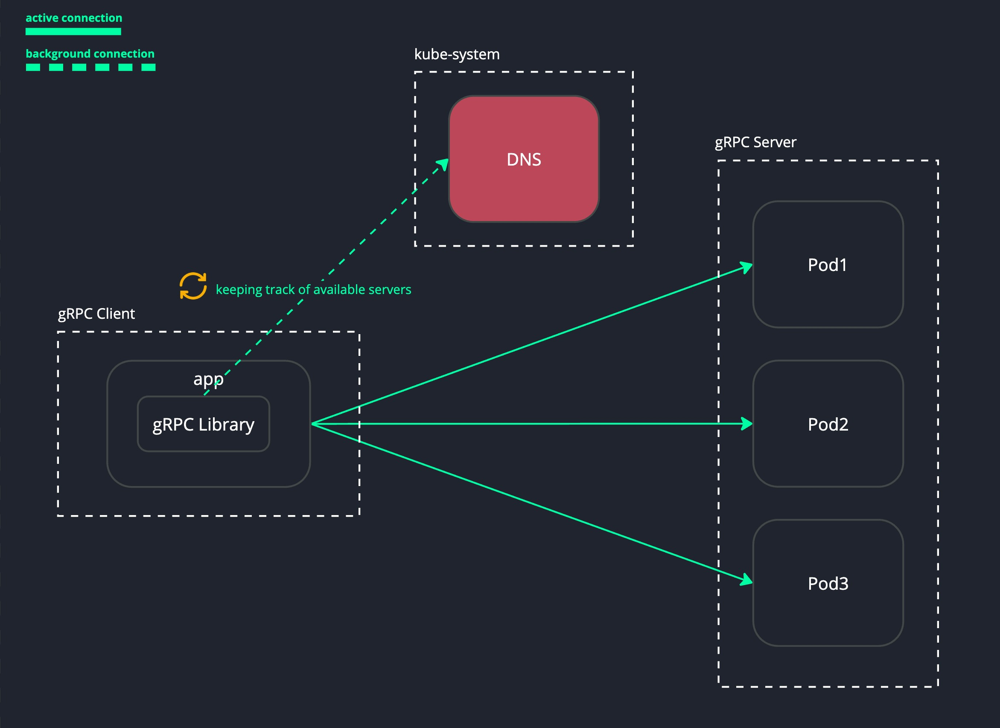
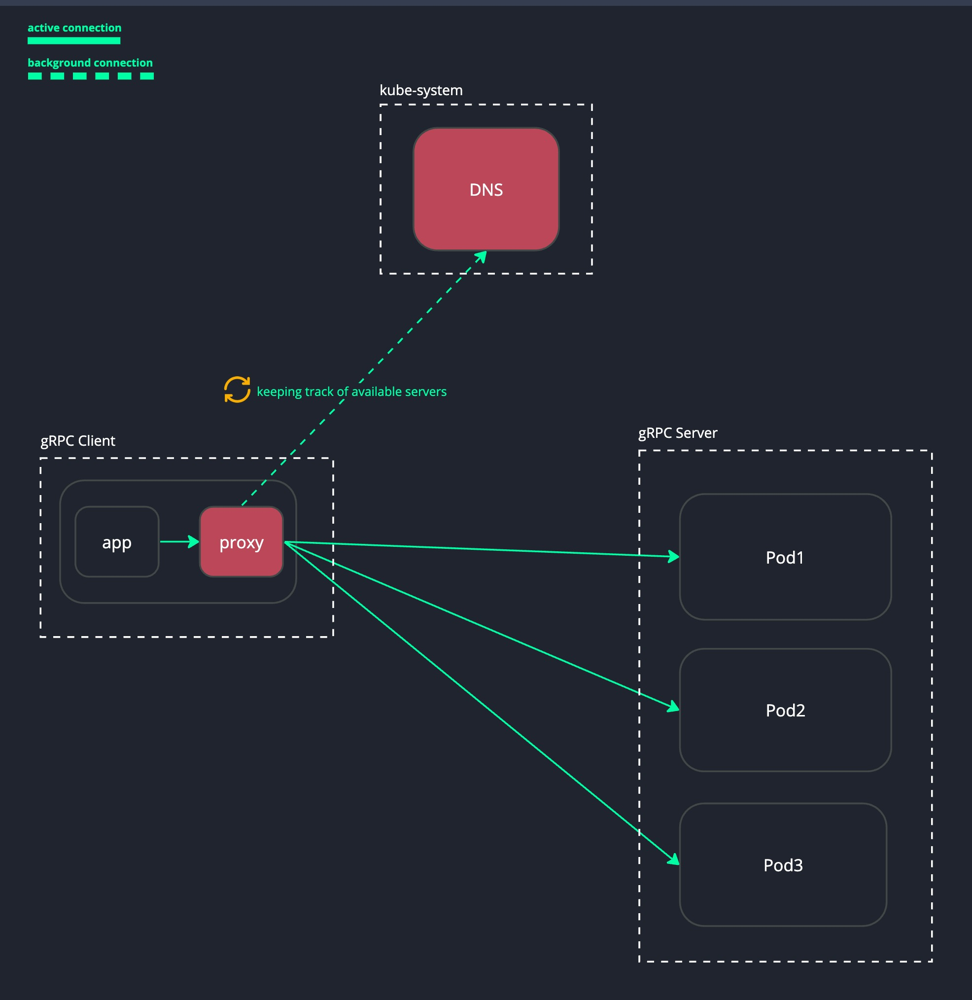
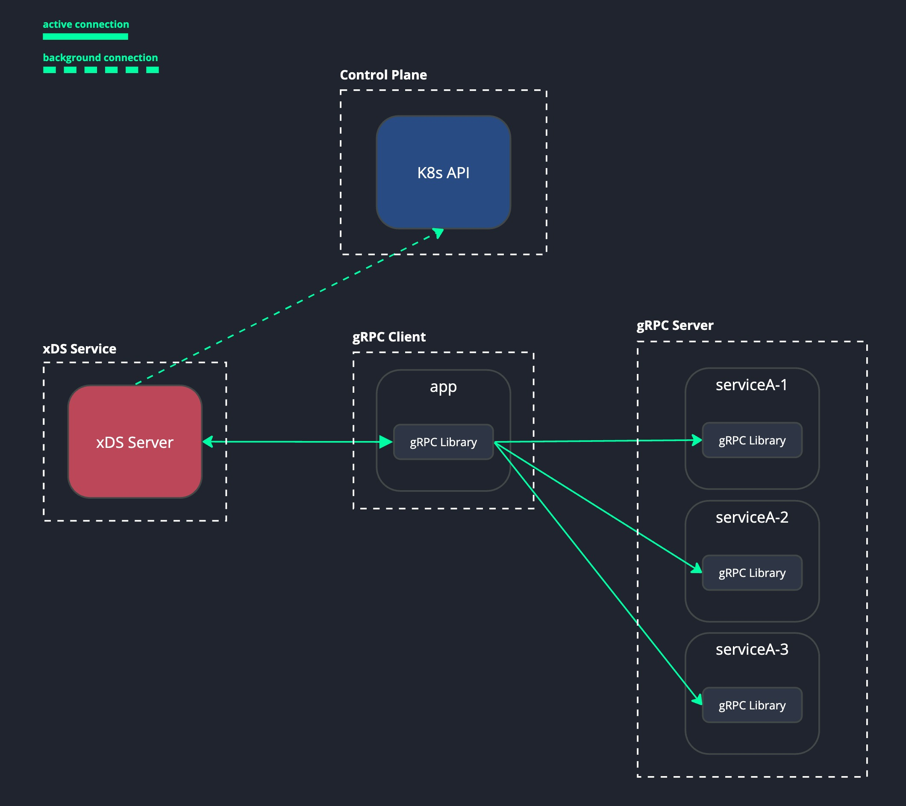
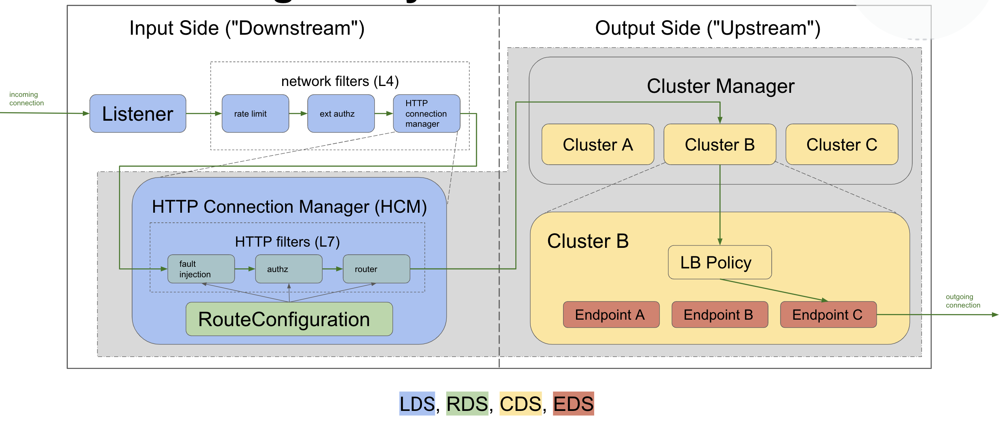
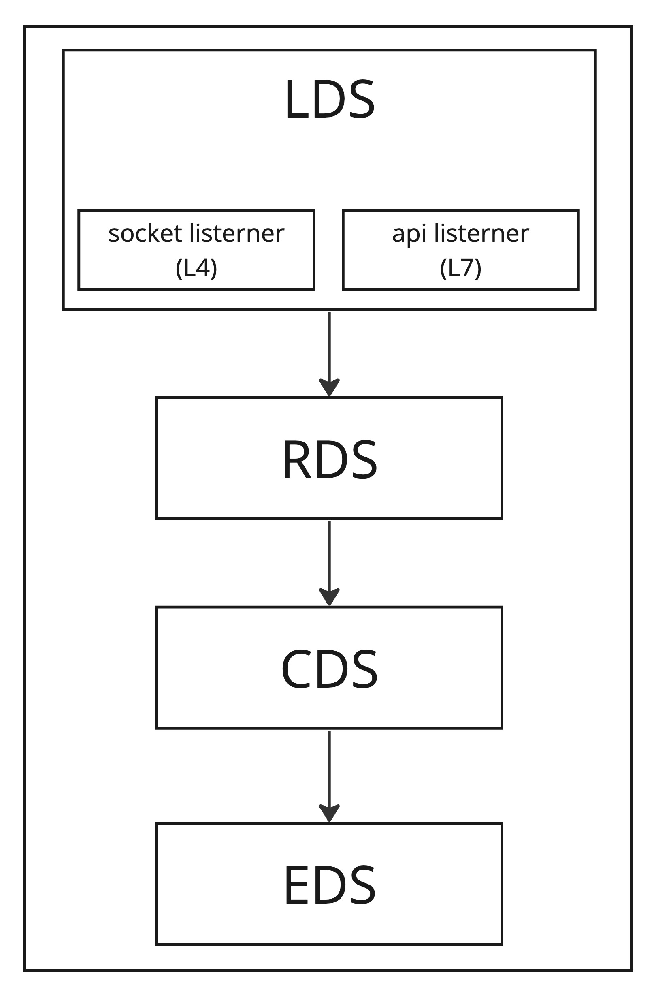
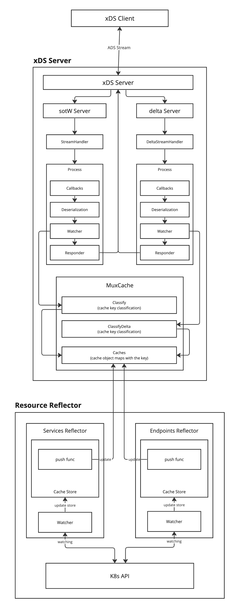

**Table of Contents**
- [Area of problem](#area-of-problem)
- [Demo Environment](#demo-environment)
- [Demo Setup](#demo-setup)
  - [setup a `microk8s` cluster](#setup-a-microk8s-cluster)
  - [setup environment](#setup-environment)
  - [setup repository & workflows](#setup-repository--workflows)
  - [Deployments](#deployments)
    - [Create Namesapce](#create-namesapce)
    - [Servers](#servers)
    - [Clients](#clients)
    - [Host Mapping](#host-mapping)
  - [Monitoring](#monitoring)
    - [watch gRPC default server service](#watch-grpc-default-server-service)
    - [watch gRPC headless server service](#watch-grpc-headless-server-service)
- [Example 1: Retrieve IPs via DNS and use Round Robin Loadbalancing with gRPC's built-in load-balancing policy](#example-1-retrieve-ips-via-dns-and-use-round-robin-loadbalancing-with-grpcs-built-in-load-balancing-policy)
  - [Performance (Approximately)](#performance-approximately)
- [Example 2: Retrieve IPs via DNS and use Round Robin Loadbalancing with statically configured Envoy proxy](#example-2-retrieve-ips-via-dns-and-use-round-robin-loadbalancing-with-statically-configured-envoy-proxy)
  - [Performance (Approximately)](#performance-approximately-1)
- [Example 3: Client LoadBalancing with xDS Management Server](#example-3-client-loadbalancing-with-xds-management-server)
  - [Glossary](#glossary)
  - [Protocol](#protocol)
  - [Transport](#transport)
  - [Envoy Structure](#envoy-structure)
  - [Implementation](#implementation)
    - [Application Workflow](#application-workflow)
  - [Performance (Approximately)](#performance-approximately-2)
  - [gRPC Client Setup(Golang)](#grpc-client-setupgolang)
    - [Bootstrap file](#bootstrap-file)
- [Warn](#warn)

# Area of problem
gRPC is over HTTP2 by default(HTTP3 is coming), as we generally know that HTTP2 uses the concept of stream, which means we have a single connection that handles multiple requests by multiplexing/demultiplexing, this reduces the overhead of establishing a new connection every time we make an HTTP request. Since we have only one connection, in order to handle a bunch of requests, to balance the load we have to look at the L7 but our applications are running on k8s environment, and the default service kind deployment uses L4 to balance the loads

# Demo Environment
- VM Instance on GCP
- Machine type `e2-standard-4`
- CPU Architecture `x86/64`
- OS Ubuntu `20.04-focal-v20240125`

# Demo Setup
## setup a `microk8s` cluster
- install `microk8s` on your device
- run `microk8s enable metallb`
- run `microk8s enable ingress`
- run `microk8s kubectl apply -f ingress-lb-service.yml`
- setup private registry
    - `vim /var/snap/microk8s/current/args/containerd-template.toml`
    - add this section at the end of file
    ```
    # private repository
    [plugins."io.containerd.grpc.v1.cri".registry.configs."<REGISTRY_DOMAIN_NAME>".auth]
    username = "_json_key_base64"
    password = "<BASE64_CREDENTAIL_CONTENT>"
    email = "bitkuber@example.com"
    ```
## setup environment
This demo uses GCR as a private registry, so, we have to export some variables for the deployment files
- `export ARTIFACT_REGION=<REGION>`
- `export ARTIFACT_PROJECT_ID=<PROJECT_ID>`

## setup repository & workflows
- Go to Settings -> Environments then added these variables 
    - `ARTIFACT_PROJECT_ID` put your projectID into this fied as a `Secrets`
    - `GCR_CREDENTIAL` put your service account with base64 encoded as a `Secrets`
    - `ARTIFACT_REGION` put your target region as a `Variables`

**_NOTE_**: `GCR_CREDENTIAL` permission to push an artifact to the registry is needed

## Deployments

### Create Namesapce
```shell
microk8s kubectl create namespace demo
```

### Servers
```shell
./apply.sh ./deployments/server
```
### Clients
```shell
./apply.sh ./deployments/client
```

### Host Mapping
mapping the ingress hosts into the known hosts file at `/etc/hosts` for instance, 
```shell
10.148.0.3 go-grpc-defaultclient.demo go-grpc-dnsclient.demo go-grpc-defaultclient-with-envoy.demo go-grpc-xdsclient.demo

# 10.148.0.3  is my private network interface that maps with my LB service
```

## Monitoring

you can try to scale in/out to see whether the server balanced the loads or not

### watch gRPC default server service
```shell
watch microk8s kubectl -n demo logs -f -l app.kubernetes.io/name=go-grpc-server --prefix --tail=20
```

### watch gRPC headless server service

```shell
watch microk8s kubectl -n demo logs -f -l app.kubernetes.io/name=go-grpc-headless-service-server --prefix --tail=20
```

# Example 1: Retrieve IPs via DNS and use Round Robin Loadbalancing with gRPC's built-in load-balancing policy



1. deploy ingress by applying `microk8s kubectl apply -f ./dnsclient/ingress.yml -n <app_namespace>`
2. run `envsubst < ./dnsclient/deployment.yml | microk8s kubectl -n <app_namespace> apply -f -`
3. run `envsubst < ./server/deployment.yml | microk8s kubectl -n <app_namespace> apply -f -`
4. mapping the ingress hosts into the known hosts file at `/etc/hosts` for instance, 
    ```
    127.0.0.1 localhost
    10.123.1.1 go-grpc-dnsclient.demo

    # 10.123.1.1 is my private network interface that maps with my LB service
    ```

## Performance (Approximately)
1 pod for gRPC Client, 3 pods for gRPC Server

- 10 VUs, duration 30s
    - 1850 TPS
- 100 VUs, duration 30s
    - 3278 TPS
- 1000 VUs, duration 30s
    - 3963 TPS

# Example 2: Retrieve IPs via DNS and use Round Robin Loadbalancing with statically configured Envoy proxy



## Performance (Approximately)
1 pod for gRPC Client, 3 pods for gRPC Server

- 10 VUs, duration 30s
    - 1130 TPS
- 100 VUs, duration 30s
    - 2133 TPS
- 1000 VUs, duration 30s
    - 2621 TPS

# Example 3: Client LoadBalancing with xDS Management Server




## Glossary
xDS

xDS is a suite of APIs for configuring data plane behavior, in this context, the data plane is a piece of software that handles network traffic, such as client, server, or proxy

ADS

Aggregated xDS uses a single REST/gRPC connection to communicate with the xDS server for the resource it intends to whether LDS, RDS, CDS, or EDS

SotW

is an approach that was the original mechanism used by xDS, in which the client must specify all resource names it is interested in with each request, and for LDS and CDS resources, the server must return all resources that the client has subscribed to in each request.

delta

 refers to the difference between the current state of an object and its previous state. This could be a change in any attribute of the object, like adding or removing a label, modifying a field value, or even deleting the object entirely.

 ## Protocol
four variants of the xDS transport protocols are:

- State of the World (Basic xDS): SotW, separate gRPC stream for each resource type

- Incremental xDS: incremental, separate gRPC stream for each resource type

- Aggregated Discovery Service (ADS): SotW, aggregate stream for all resource types

- Incremental ADS: incremental, aggregate stream for all resource types

## Transport
gRPC client that uses xDS will establish an ADS stream with non-delta which is a single TCP connection and separates each resource (LDS, RDS, CDS, EDS) in each channel to communicate with the xDS server. [See the implementation](https://github.com/grpc/grpc-go/blob/eb08be40dba28d0889f187e95cf42f3984f5f9b4/xds/internal/xdsclient/transport/transport.go#L269C59-L269C84)

## Envoy Structure



**_NOTE_**: The APIListener is use to skip the TCP filters and goes right to the HCM config

## Implementation
since the gRPC client xDS relies on a non-delta ADS stream, so, the xDS management server can provide only an API for <b>SotW Server


### Application Workflow


## Performance (Approximately)
1 pod for gRPC Client, 3 pods for gRPC Server

- 10 VUs, duration 30s
    - 1486 TPS
- 100 VUs, duration 30s
    - 3040 TPS
- 1000 VUs, duration 30s, 
    - 3655 TPS

## gRPC Client Setup(Golang)
### Bootstrap file
- set path that point to the bootstrap file by set an ENV `GRPC_XDS_BOOTSTRAP` or put entire JSON content into this variable `GRPC_XDS_BOOTSTRAP_CONFIG`
- see [gRFC A27](https://github.com/grpc/proposal/blob/master/A27-xds-global-load-balancing.md#xdsclient-and-bootstrap-file) for the bootstrap format
- see the list of `server_features` available [here](https://github.com/grpc/grpc-go/blob/eb08be40dba28d0889f187e95cf42f3984f5f9b4/xds/internal/xdsclient/bootstrap/bootstrap.go#L53)

Example:

```json
{
    "xds_servers": [
        {
            "server_uri": "grpc-xdsserver.demo.svc.cluster.local:80",
            "channel_creds": [{"type": "insecure"}],
            "server_features": ["xds_v3"]
        }
    ],
    "node": {
        "id": "default",
        "locality": {
            "zone" : "k8s"
        }
    }
}
```

# Warn
 The performance result could not reflect the real performance, due to various factors whether networking,  environment, etc. In my scenario, everything is on my Virtual Machine